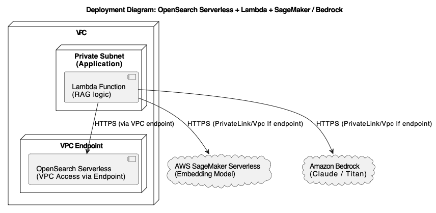
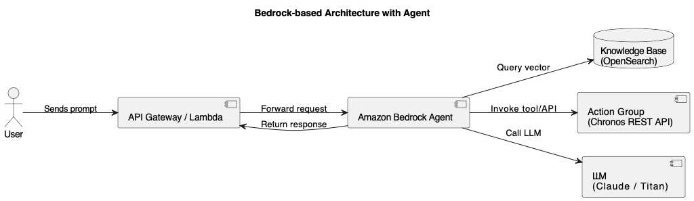
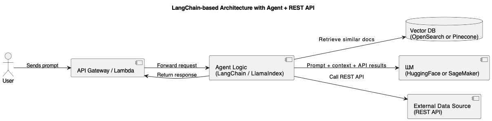
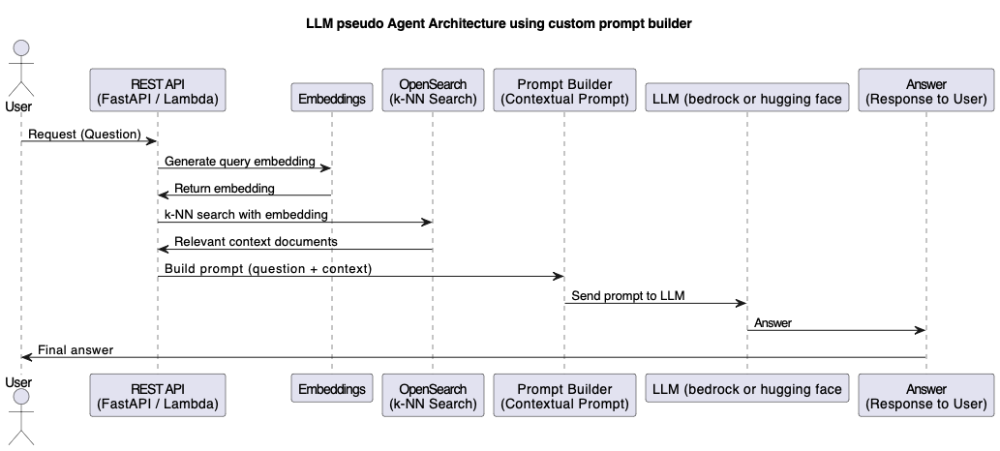

# About

## Setup

Configuring AWS for github deployments:

1. Deploy github-oidc-role.yaml to allow deploy via github actions. This can be done via the browser or from a cloud shell using the command `aws cloudformation deploy ...`. Parametrize with "oganization/repo".
2. `aws iam create-open-id-connect-provider \
  --url https://token.actions.githubusercontent.com \
  --client-id-list sts.amazonaws.com \
  --thumbprint-list 6938fd4d98bab03faadb97b34396831e3780aea1`
  (The thumbprint is for GitHub’s cert (correct as of 2024–2025)

export AWS_DEFAULT_REGION="eu-central-1"
export CDK_DEFAULT_REGION="eu-central-1"
export AWS_DEFAULT_PROFILE="944997240237_PA_FULLADMIN"
export AWS_PROFILE="944997240237_PA_FULLADMIN"
export CDK_DEFAULT_ACCOUNT="944997240237"

cd lambda/provision
python3 -m venv .venv
source .venv/bin/activate
pip install --upgrade pip
pip install -r requirements.txt -t .
deactivate

## Agent comparisons

Using a bedrock agent or a generic one depends on several criteria, e.g. ease-of-use, customizability...

### Bedrock

### Implementation

#### Using Bedrock

Bedrock Agents can:
- Receive natural language inputs
- Use knowledge bases for retrieval (like RAG)
- Call Lambda functions or APIs (via action groups)
- Manage multi-turn conversations
- Orchestrate everything using guardrails and policies.

1. Knowledge Base (opensearch is defined ) via the AWS Console or SDK
2. Create an agent and attach this knowledge base. 

Scenario: “In which system do I find my vacation balance?”
    - The Bedrock Agent:
	    1. Decides it needs real-time data: → calls the REST API via Action Group
	    2. Combines the result in a fluent response
    

Scenario: “How can I change my maternal leave period?”
    - The Bedrock Agent:
	    1. Automatically generates the embedding (no Lambda for this)
	    2. Queries OpenSearch Serverless to find the best answer from the FAQ.
	    3. Inserts the top documents into the prompt
	    4. Sends that to Claude or Titan
	    5. Combines the result in a fluent response

So, for bedrock, we need no code to embed, search, or inject context.

#### Using LangChain or LlamaIndex

In open-source frameworks like LangChain or LlamaIndex we need to implement more custom logic / boiler plate code:

- A retriever / component to connect to OpenSearch / Pinecone, Rest-API
- Code to:
  - embed the query
  - search the vector-db
  - format the results for the LLM

#### Pseudo-Agent with Prompt Builder

Scenario:
 1. Question: How many vacation days do I have left
 2. Query OpenSearch 
 3. Use result to to build prompt: "use the following context to answer the question: Users are entitled to 30 days of vacation per year. Vacation days reset on January 1st.
 4. Send question and prompt to LMM
 5. return fluent respose

